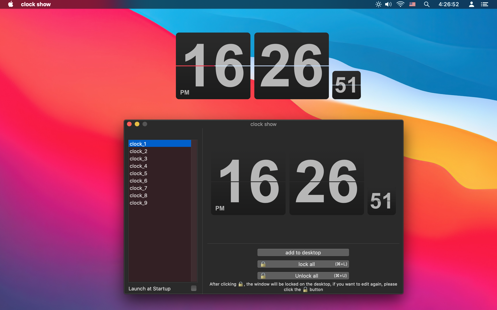
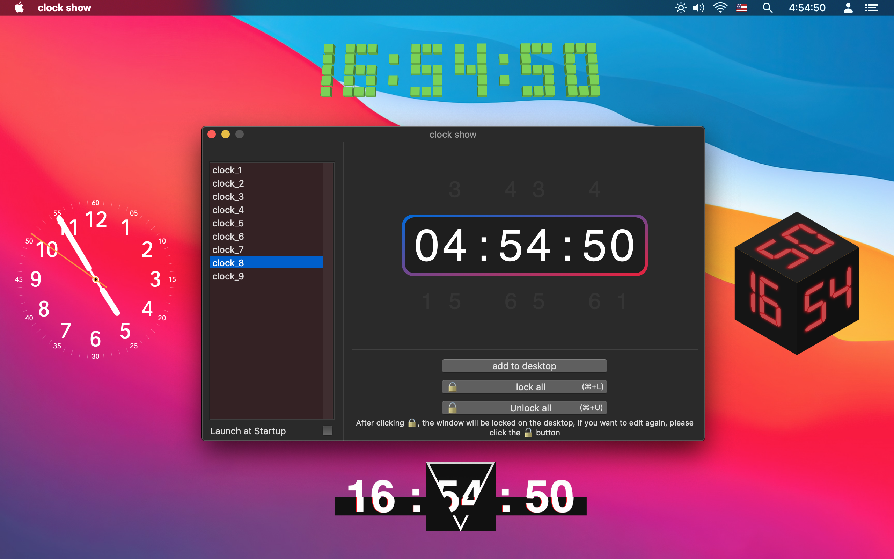

[< back](../)

# clock show

Set the desktop dynamic clock, you can add multiple to the desktop, and a variety of clock styles are available.   
After selecting a clock in the list on the left, click "Add to Desktop", drag the position, change the size, background color, etc.   

 

   
   

