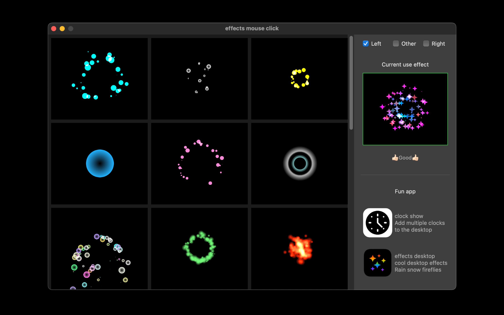
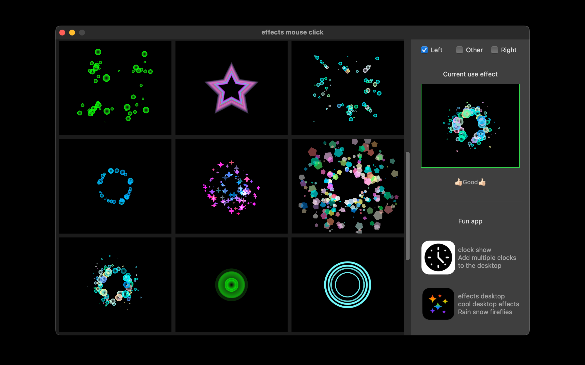

[< back](../)

# effects mouse click

effects mouse click - very cool mouse click effects, a variety of effects to choose from, constantly updated.   
1. Simply select from the list to use.   
2. Select 'Left' 'Right' 'Other'.   

 

   
   

