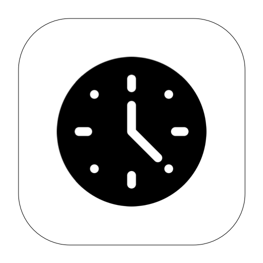

 

<a href="./clockshow/clockshow"  class="button fork">

<strong>clock show
 Set the desktop dynamic clock, you can add multiple to the desktop, and a variety of clock styles are available.   
</strong>

</a>

 

<a href="./wallpapervideo/wallpapervideo"  class="button fork">

<strong>wallpaper video
 Use local video to set desktop dynamic wallpaper, pure DIY, without any network link, support multi-monitor settings.    
</strong>

</a>

 

 

 

 

 

 

 

 

 

end

