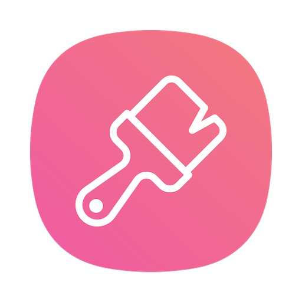

# App List

 

<a href="./wallpapervideo/wallpapervideo"  class="button fork">

<strong>wallpaper video
 Use local video to set desktop dynamic wallpaper, pure DIY, without any network link, support multi-monitor settings.    
</strong>

</a>

 

 

 

 

 

 

 

 

 

 

end

